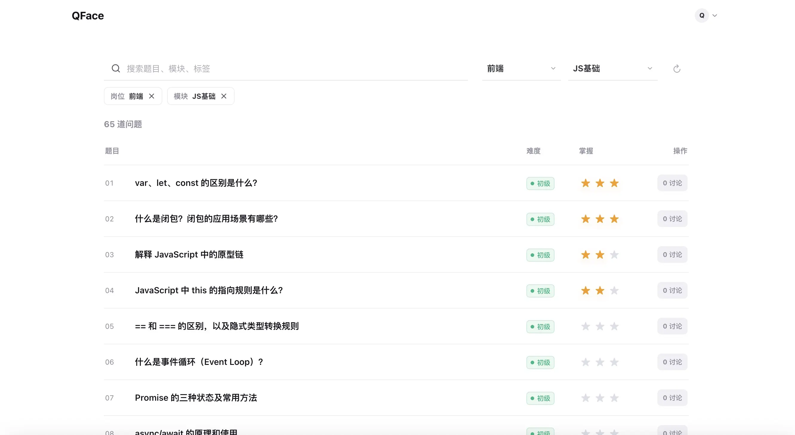
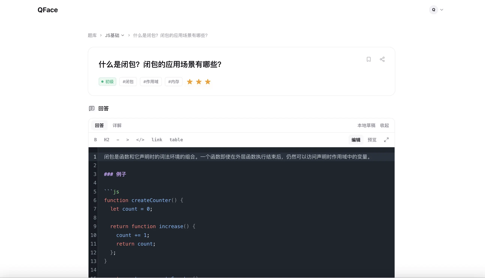

<div align="center">

# QFace

**面试题库 · 用户作答社区**

[立即体验](https://qface.dogxi.me) · [报告问题](https://github.com/dogxii/QFace/issues) · [功能建议](https://github.com/dogxii/QFace/issues)


</div>

---

## 👀 预览

https://qface.dogxi.me

<div align="center">
  
  
</div>

## 📚 简介

QFace 是一个从 iFace 固定题库延伸出来的中文面试题学习与问答社区。它保留题库本身，但不导入、不展示 iFace 里的 AI 生成答案；每道题都以“固定问题 + 用户作答 + 讨论沉淀”的方式组织。

**核心理念：** 与其只看一份不一定好读的标准答案，不如先写出自己的理解，再参考其他人的回答、详解和讨论，把八股题真正变成能表达、能复盘、能长期积累的知识。

## ⚡️ 功能特性

- 固定题库：题目来自 iFace，覆盖前端、AI Agent、Golang、Java 等方向
- 高效筛选：支持按岗位、模块、难度、关键词筛选，并记住上次学习位置
- 用户作答：每道题支持「回答」和「详解」两份草稿，本地实时保存
- Markdown 编辑：支持快捷工具栏、编辑态高亮、预览、代码高亮和全屏双栏编辑
- 社区讨论：公开回答可被点赞、点踩、回复和采纳，逐步沉淀更好的人类答案
- 面经帖子：发布面试经历，支持面试日期、顶/踩、回复，并把面试题快速关联回 QFace 题库
- 学习进度：三颗星掌握度、做过题数、模块完成进度和本地收藏
- 数据导出：笔记页导出 Markdown，账号面板备份 / 导入 JSON
- 低运维部署：Cloudflare Pages + Pages Functions + D1，无需自购服务器

## 🚀 快速开始

线上版本：

https://qface.dogxi.me

支持 GitHub 登录。未登录也可以在本地写作答、标记掌握度和收藏题目。

## 本地运行

```bash
# 克隆仓库
git clone https://github.com/dogxii/QFace.git
cd QFace

# 安装依赖
bun install

# 生成题库数据
bun run content:generate

# 启动开发服务器
bun run dev
```

访问 [http://localhost:5173](http://localhost:5173)

如需完整 API、OAuth 和 D1 环境：

```bash
bun run build
bun run db:migrate:local
bun run pages:dev
```

访问 [http://localhost:8788](http://localhost:8788)

## 🔐 环境变量

复制环境变量模板：

```bash
cp .env.example .env
```

需要配置：

```dotenv
GITHUB_CLIENT_ID=
GITHUB_CLIENT_SECRET=
COOKIE_SECRET=replace-with-a-long-random-secret
SITE_URL=http://localhost:8788
VITE_QFACE_REPO_URL=https://github.com/dogxii/QFace
```

`COOKIE_SECRET` 用于签名 OAuth state 和 session cookie，生产环境请使用足够长的随机字符串。

## 🧭 使用指南

### 写作答

1. 打开任意题目详情页
2. 在「回答」里写适合面试时直接表达的版本
3. 在「详解」里补充原理、例子、代码和易错点
4. 需要公开时再点击发布；草稿不会自动进入社区流

### 管理笔记

- 右上角头像进入账号面板，可查看学习进度、备份和导入 JSON
- 进入「笔记」页可搜索自己的作答，并导出 Markdown
- 收藏仅保存在本地，适合做轻量题目书签

### 发布面经

1. 进入「面经」页，点击「写面经」
2. 填写标题，可选设置面试日期
3. 粘贴真实面试问题和过程，普通换行会在预览和帖子中保留
4. 使用「关联题目」搜索并插入 `[↗]` 题库链接
5. 也可以点击「自动匹配题库」，快速把常见八股问题连回题库

### 生成题库

默认读取相邻的 `../iFace/public/questions`：

```bash
bun run content:generate
```

如果 iFace 路径不同，可指定目录：

```bash
IFACE_QUESTIONS_DIR=/path/to/iFace/public/questions bun run content:generate
```

生成物只包含题面、分类、模块、难度、标签、来源和内容哈希；iFace 的 `answer` 字段不会进入 QFace。

## 🧱 技术栈

| 模块     | 方案                                         |
| -------- | -------------------------------------------- |
| 前端     | React 19 + Vite + TanStack Router            |
| 编辑器   | CodeMirror + Markdown / GFM / highlight.js   |
| API      | Cloudflare Pages Functions                   |
| 数据库   | Cloudflare D1                                |
| 登录     | GitHub OAuth + HttpOnly session cookie       |
| 本地状态 | localStorage                                 |
| 工具链   | Bun + TypeScript + Biome + Vitest + Wrangler |

## ✅ 常用命令

```bash
bun run check          # Biome + TypeScript
bun run check:content  # 校验题库生成结果
bun run test           # 单元测试
bun run build          # 生产构建
```

## 🚢 部署

部署说明见 [docs/DEPLOYMENT.md](./docs/DEPLOYMENT.md)。

产品与技术方案见 [docs/QFACE_PRODUCT_AND_TECH_PLAN.md](./docs/QFACE_PRODUCT_AND_TECH_PLAN.md)。

## 📈 项目 Star 历史

<a href="https://www.star-history.com/#dogxii/QFace&date">
 <picture>
   <source media="(prefers-color-scheme: dark)" srcset="https://api.star-history.com/chart?repos=dogxii/QFace&type=date&theme=dark" />
   <source media="(prefers-color-scheme: light)" srcset="https://api.star-history.com/chart?repos=dogxii/QFace&type=date" />
   
 </picture>
</a>

## 💰 赞赏项目

如果觉得这个项目对你有帮助，欢迎请我喝咖啡 ☕️

> 采取自愿原则，收到的赞赏将用于提高开发者积极性和开发环境。

<div style="display:flex; gap:24px; align-items:center;">
  
  
</div>
